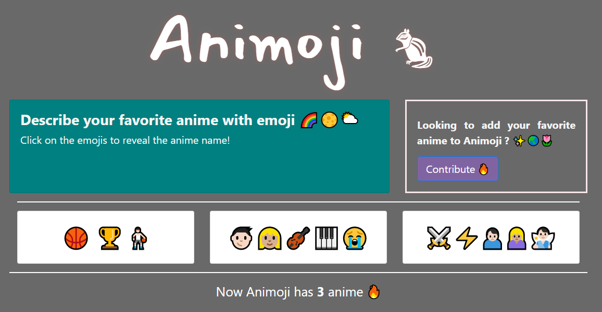

# Animoji 🐿

## Anime listing represented through emoji
Hello, welcome to Animoji repository. This repository is build for Hacktoberfest and inspired by [Emoji Screen](https://emojiscreen.com).

You can visit at [animoji.netlify.com](https://animoji.netlify.com)
## Contribute 🤝
Perfect practice for your first open source pull request!
For those who wants to contribute, you can check out at [CONTRIBUTING.md](CONTRIBUTING.md) for furthermore.
### Pull Request
You can directly send a pull request to the repository if you have any anime updates, UI, or website function itself.
Please note that you have to follow the pull request template at [pull_request_template.md](https://github.com/2pai-dev/animoji/blob/master/.github/PULL_REQUEST_TEMPLATE/pull_request_template.md). We won't accept any nonsense updates like removing whitespaces, or update a few words in README.
#### Anime Addition
If you check [listAnime.js](https://github.com/2pai-dev/animoji/blob/master/src/store/listAnime.js), there are some information that you have to fill like anime name, aired year, etc. If you need any references for the information, you can take a look at [https://myanimelist.net](https://myanimelist.net).
### Issues
We are very appreciate for those who contribute by `help wanted` or/and `good first issue` label. And if you have a commit that referencing to some issues, don't forget to add them on your commit message.
